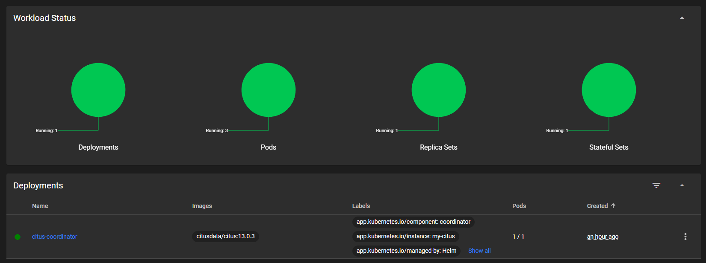

# Citus na Kubernetes

Projekt postavitve distribuirane PostgreSQL podatkovne baze Citus na Kubernetes z uporabo Helm chart-a.

## Pregled projekta

Ta projekt prikazuje postavitev Citus podatkovne baze na lokalno Kubernetes okolje (Minikube). Citus je razširitev PostgreSQL-a, ki omogoča horizontalno skaliranje preko več vozlišč.

### Arhitektura

- **1 koordinator (master)**: Osrednje vozlišče, ki upravlja poizvedbe
- **2 delovni vozlišči (workers)**: Shranjujeta in obdelujeta podatke
- **Sharding**: Podatki so avtomatsko porazdeljeni med delovnimi vozlišči

## Navodila za namestitev

### Predpogoji

- Nameščen Docker
- Nameščen Minikube
- Nameščen Kubernetes CLI (kubectl)
- Nameščen Helm

### 1. Zagon lokalnega Kubernetes okolja

```bash
# Zagon Minikube
minikube start --driver=docker

# Preverjanje statusa
minikube status
```

### 2. Namestitev Citus z uporabo Helm chart-a

```bash
# Kloniranje repozitorija
git clone https://github.com/adonnisss/citus-kubernetes.git
cd citus-kubernetes

# Namestitev Helm chart-a
helm install my-citus ./citus
```

### 3. Preverjanje namestitve

```bash
# Preverjanje podov
kubectl get pods

# Preverjanje storitev
kubectl get services
```

### 4. Povezava na podatkovno bazo

```bash
# Port forwarding do koordinatorja
kubectl port-forward svc/citus-coordinator 5432:5432

# Povezava s psql klientom (v novem terminalu)
PGPASSWORD=postgres psql -h localhost -p 5432 -U postgres myappdb
```

### 5. Preverjanje shardinga

```sql
-- Preveri registrirana delovna vozlišča
SELECT * FROM master_get_active_worker_nodes();

-- Preveri distribucijo shardov
SELECT logicalrelid::regclass AS table_name, 
       nodename, 
       count(*) as shard_count
FROM pg_dist_shard
JOIN pg_dist_placement USING (shardid)
JOIN pg_dist_node ON nodeId = nodeid
GROUP BY logicalrelid, nodename
ORDER BY table_name, nodename;
```

## Opis rešitve

### Uporabljene tehnologije

- **Kubernetes**: Platforma za orkestriranje kontejnerjev
- **Helm**: Upravitelj paketov za Kubernetes
- **Citus**: Distribuirana različica PostgreSQL-a
- **StatefulSets**: Za upravljanje delovnih vozlišč z stabilnimi omrežnimi identitetami
- **Post-install Jobs**: Za avtomatsko konfiguracijo po namestitvi

### Struktura Helm chart-a

- **Coordinator Deployment**: Postavitev glavnega vozlišča
- **Worker StatefulSet**: Postavitev delovnih vozlišč s persistentnimi volumni
- **Services**: Omrežne storitve za komunikacijo med komponentami
- **ConfigMap**: Konfiguracija in inicializacijske skripte
- **Post-install Job**: Avtomatska postavitev Citus razširitve in registracija vozlišč

### Sharding in distribucija podatkov

V projektu uporabljamo dve tabeli za demonstracijo shardinga:
- Tabela `users` je distribuirana po stolpcu `id`
- Tabela `orders` je distribuirana po stolpcu `user_id` za kolokacijo s tabelo users

## Zaslonski posnetki

### Kubernetes Dashboard


### Delujoči podi


### Distribucija podatkov


### Distribucija shardov po vozliščih


## Zaključek

Ta projekt prikazuje postavitev distribuirane PostgreSQL podatkovne baze Citus na Kubernetes okolje z uporabo Helm chart-a.
